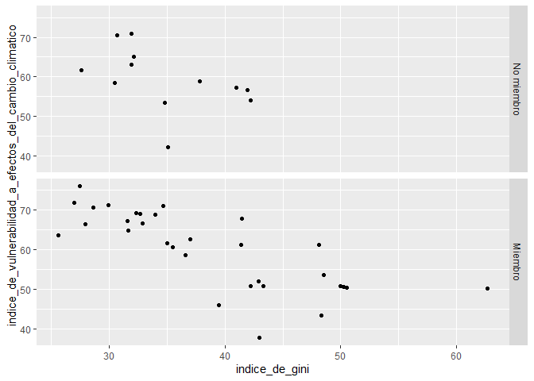
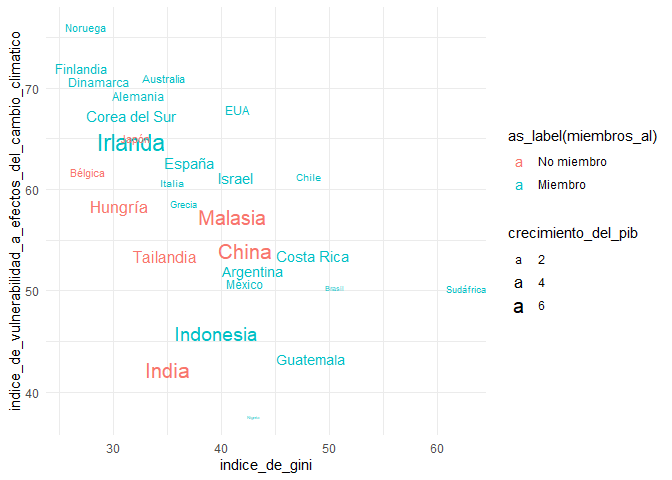

Práctica 3 - Más gráficos + Indicadores sumativos
================
Ana Escoto
02/06/2021

# Previo

``` r
if (!require("pacman")) install.packages("pacman") # instala pacman si se requiere
```

    ## Loading required package: pacman

``` r
pacman::p_load(tidyverse, readxl,haven, sjlabelled, janitor, srvyr, esquisse, RColorBrewer) #carga los paquetes necesarios para esta práctica
```

Por si no tuviéramos cargada la base de datos, la volveremos a cargar

``` r
lapop2019 <- read_dta("./datos/lapop2019.dta")
```

También vamos usar la base de Índice de Competitividad Internacional
ICI, desarrollado por el Instituto Mexicano de Competitividad. (véase
<http://imco.org.mx/indices/mexico-suenos-sin-oportunidad/>)

``` r
ICI_2018 <- read_excel("./datos/ICI_2018.xlsx", sheet = "para_importar")
```

    ## New names:
    ## * `` -> ...128
    ## * `` -> ...129
    ## * `` -> ...132
    ## * `PIB (Paridad de Poder Adquisitivo)` -> `PIB (Paridad de Poder Adquisitivo)...135`
    ## * `PIB (Paridad de Poder Adquisitivo)` -> `PIB (Paridad de Poder Adquisitivo)...136`
    ## * ...

``` r
ICI_2018 <- clean_names(ICI_2018) # limpia los nombres
```

# ¿Cuál es el mejor gráfico?

Hay cursos específicos de visualización de datos. Es maravilloso pero
también requiere que estudiemos bien qué tipo de datos tenemos y cuáles
son nuestros objetivos.

Me gusta mucho este recurso: <https://www.data-to-viz.com/>

# Gráficos de base

“plot()” Es la función más simple. Y es otro comando “listo”

``` r
  plot(as_label(lapop2019$soct2))
```

<!-- -->

Esto es igual que:

``` r
barplot(table(as_label(lapop2019$soct2)))
```

<!-- -->

``` r
  plot(as_label(lapop2019$soct2), 
       main=paste(get_label(lapop2019$soct2)))
```

<!-- -->

También tnemos histograma y el boxplot.

``` r
hist(ICI_2018$esperanza_de_vida)
```

<!-- -->

``` r
boxplot(ICI_2018$esperanza_de_vida)
```

<!-- -->

# Gráficos con ggplot

Hoy vamos a presentar a un gran paquete ¡Es de los famosos! Y tiene más
de diez años.

-   <https://qz.com/1007328/all-hail-ggplot2-the-code-powering-all-those-excellent-charts-is-10-years-old/>

“gg” proviene de “Grammar of Graphics”, funciona un poco como
sintácticamente, de ahí su nombre.

Algunos recursos para aprender ggplot

-   <https://ggplot2-book.org/> hecha por el mero mero.

-   <http://sape.inf.usi.ch/quick-reference/ggplot2>

-   <https://raw.githubusercontent.com/rstudio/cheatsheets/master/data-visualization-2.1.pdf>

Vamos a revisar una presentación que es muy interesante

-   <https://evamaerey.github.io/ggplot2_grammar_guide/ggplot2_grammar_guide.html>

-   <https://huygens.science.uva.nl/ggPlotteR/> Hace gráficos de ggplot
    con la base de datos de Gapminder

# Un lienzo para dibujar

Para hacer un gráfico, ggplot2 tiene el comando “ggplot()”. Hacer
gráficos con esta función tiene una lógica aditiva. Lo ideal es que
iniciemos estableciendo el mapeo estético de nuestro gráfico, con el
comando aes()

``` r
g1<-lapop2019 %>%
  ggplot(aes(as_label(soct2)))

g1 # imprime el lienzo
```

<!-- -->

# Gráficos univariados

## Para cualitativas

``` r
g1 + geom_bar()
```

<!-- -->

``` r
g1 +  geom_bar(aes(
  fill = as_label(q1)
  )) # colorea la geometría
```

<!-- -->

``` r
# Esto es equivalente

lapop2019 %>%
  ggplot(aes(as_label(soct2),
             fill = as_label(q1)
             )
         ) + geom_bar()
```

<!-- --> \#\# Para
variables cuantitativas Podemos hacer histogramas y gráficos de
densidad, de manera fácil. La idea es agregar en nuestro “lienzo” una
geometría, un valor para dibujar en él. Esto se agrega con un “+” y con
la figura que se añadirá a nuestro gráfico.

``` r
g2<-lapop2019 %>%
  ggplot(aes(ed))

g2 # imprime el lienzo
```

    ## Don't know how to automatically pick scale for object of type haven_labelled/vctrs_vctr/double. Defaulting to continuous.

<!-- -->

### Histograma

``` r
g2 + geom_histogram() 
```

    ## Don't know how to automatically pick scale for object of type haven_labelled/vctrs_vctr/double. Defaulting to continuous.

    ## `stat_bin()` using `bins = 30`. Pick better value with `binwidth`.

    ## Warning: Removed 12 rows containing non-finite values (stat_bin).

<!-- --> No es igual al
histograma de base por el número de “cajas”. Esto lo podemos modificar:

``` r
g2 + geom_histogram(bins=10) 
```

    ## Don't know how to automatically pick scale for object of type haven_labelled/vctrs_vctr/double. Defaulting to continuous.

    ## Warning: Removed 12 rows containing non-finite values (stat_bin).

<!-- -->

### Densidad

``` r
g2 + geom_density()
```

    ## Don't know how to automatically pick scale for object of type haven_labelled/vctrs_vctr/double. Defaulting to continuous.

    ## Warning: Removed 12 rows containing non-finite values (stat_density).

<!-- -->

# Gráficos bivariados

## Cuali-cuali

``` r
g1 +  geom_bar(aes(fill = as_label(q1)),
              position="dodge") #pone las categorías lado a lado y no apiladas
```

<!-- -->

Otra manera interesante de observar estas variables, es que estándo
apiladas, cada categoría de escolaridad se entendiera como una unidad:

``` r
g_bivariado <- g1 +  geom_bar(aes(fill = as_label(q1)),
              position="fill") # cada categoría "llena" a una unidad

g_bivariado
```

<!-- -->

Escalas de color: RcolorBrewer es el más famoso.

``` r
g_bivariado + scale_fill_brewer(palette = "Dark2")
```

<!-- -->

Cambiamos el tema:

``` r
g_bivariado + scale_fill_brewer(palette = "Dark2") + theme_minimal()
```

<!-- -->

## Cuanti - cuanti

Los gráficos más usuales son los *scatter plot*

``` r
ICI_2018 %>% 
  ggplot(aes(indice_de_gini,
             indice_de_vulnerabilidad_a_efectos_del_cambio_climatico)) +
  geom_point()
```

<!-- -->

Hay otra geometría que puede ser útil: la geometría “jitter”

``` r
ICI_2018 %>% 
  ggplot(aes(indice_de_gini,
             indice_de_vulnerabilidad_a_efectos_del_cambio_climatico)) +
  geom_jitter()
```

<!-- --> En lugar de
puntos podemos incluir texto:

``` r
# geometría "text"

ICI_2018 %>% 
  ggplot(aes(indice_de_gini,indice_de_vulnerabilidad_a_efectos_del_cambio_climatico)) +
  geom_text(aes(label=indicador))
```

<!-- -->

``` r
# geometría "label"

ICI_2018 %>% 
  ggplot(aes(indice_de_gini,indice_de_vulnerabilidad_a_efectos_del_cambio_climatico)) +
  geom_label(aes(label=indicador))
```

<!-- -->

### Una tercera variable

Aprovechamos para etiquetar

``` r
etiqueta<-c("No miembro", "Miembro")
ICI_2018<-ICI_2018 %>% 
  set_labels(miembro_de_la_alianza_para_el_gobierno_abierto, labels=etiqueta)
```

¿Ese nombre nos es útil? Está larguísimo. Podemos renombrar:

``` r
ICI_2018<-ICI_2018 %>% 
  dplyr::rename(miembros_al=miembro_de_la_alianza_para_el_gobierno_abierto)
```

Una vez ya etiquetada vamos incluirlo como un punto diferente por color
o por forma:

``` r
# Introducción de una tercera variable con color

ICI_2018 %>% 
  ggplot(aes(x=indice_de_gini,
             y=indice_de_vulnerabilidad_a_efectos_del_cambio_climatico,
             color=as_label(miembros_al))
         ) +
  geom_point()
```

<!-- -->

``` r
# Introducción de una tercera variable con "shape"

ICI_2018 %>% 
  ggplot(aes(x=indice_de_gini,
             y=indice_de_vulnerabilidad_a_efectos_del_cambio_climatico,
             shape=as_label(miembros_al))
  ) +
  geom_point() # ojo, hay un límite para las formas
```

<!-- -->

### Más variables con “facets”

Podemos introducirt más variable con “facet”. Sobre todo si no son
tantas categorías. Hay tres tipos de facets.

*facet\_wrap*:

``` r
ICI_2018 %>% 
  ggplot(aes(x=indice_de_gini,
             y=indice_de_vulnerabilidad_a_efectos_del_cambio_climatico)) +
  geom_point() + facet_wrap(~as_label(miembros_al))
```

<!-- -->

*facet\_grid*: Nos permite colocar en filas o en columnas.

``` r
# columnas 
ICI_2018 %>% 
  ggplot(aes(x=indice_de_gini,
             y=indice_de_vulnerabilidad_a_efectos_del_cambio_climatico)) +
  geom_point() + facet_grid(.~as_label(miembros_al))
```

<!-- -->

``` r
#filas 
ICI_2018 %>% 
  ggplot(aes(x=indice_de_gini,
             y=indice_de_vulnerabilidad_a_efectos_del_cambio_climatico)) +
  geom_point() +
  facet_grid(as_label(miembros_al)~.)
```

<!-- -->

### Suavizamiento

Hay que tener cuidado ¿podemos ver todas las relaciones?

``` r
# Smooth 

ICI_2018 %>% 
  ggplot(aes(x=indice_de_gini,
             y=indice_de_vulnerabilidad_a_efectos_del_cambio_climatico)) +
  geom_point() +
  geom_smooth(method="lm") +
  facet_grid(as_label(miembros_al)~.)
```

    ## `geom_smooth()` using formula 'y ~ x'

<!-- -->

``` r
ICI_2018 %>% 
  ggplot(aes(x=indice_de_gini,
             y=indice_de_vulnerabilidad_a_efectos_del_cambio_climatico,
             color=as_label(miembros_al))) +
  geom_text(aes(label=indicador)) +
  geom_smooth(method="lm") + scale_fill_brewer(palette = "Dark2") +
  theme_minimal()
```

    ## `geom_smooth()` using formula 'y ~ x'

<!-- -->

### Muchas más variables

Hay que tener cuidado ¿Podemos ver todas estas variables?

``` r
# Introducción de una cuarta variable cuanti
  
ICI_2018 %>% 
  ggplot(aes(x=indice_de_gini,
             y=indice_de_vulnerabilidad_a_efectos_del_cambio_climatico,
             color=as_label(miembros_al))) +
  geom_point(aes(size=crecimiento_del_pib))+ # ojo
  theme_minimal()
```

<!-- -->

``` r
# Equivalente  

ICI_2018 %>% 
  ggplot(aes(x=indice_de_gini,
             y=indice_de_vulnerabilidad_a_efectos_del_cambio_climatico,
             color=as_label(miembros_al),
             size=crecimiento_del_pib)) +
  geom_point()+ 
  theme_minimal()
```

<!-- -->

``` r
# Agregaremos etiquetas

ICI_2018 %>% 
  ggplot(aes(x=indice_de_gini,
             y=indice_de_vulnerabilidad_a_efectos_del_cambio_climatico,
             color=as_label(miembros_al),
             size=crecimiento_del_pib)) +
  geom_text(aes(label=indicador),
            check_overlap = TRUE)+
  theme_minimal()
```

<!-- -->

# Cuanti y cuali

Para ello vamos a tomar como base la variable cuanti e introduciremos
capas donde definimos la variable cualitativa.

Volvamos a lapop2019

``` r
lapop2019 %>%
  ggplot(aes(ed)) # años de escolaridad
```

    ## Don't know how to automatically pick scale for object of type haven_labelled/vctrs_vctr/double. Defaulting to continuous.

<!-- -->

``` r
lapop2019 %>%
  ggplot(aes(x=ed, fill=as_label(q1))) 
```

    ## Don't know how to automatically pick scale for object of type haven_labelled/vctrs_vctr/double. Defaulting to continuous.

<!-- -->

``` r
lapop2019 %>%
  ggplot(aes(x=ed, fill=as_label(q1))) + geom_density()
```

    ## Don't know how to automatically pick scale for object of type haven_labelled/vctrs_vctr/double. Defaulting to continuous.

    ## Warning: Removed 12 rows containing non-finite values (stat_density).

<!-- -->

``` r
# Modificamos la opacidad
lapop2019 %>%
  ggplot(aes(x=ed, 
             fill=as_label(q1),
             alpha=I(0.5))) + geom_density() + theme_minimal()
```

    ## Don't know how to automatically pick scale for object of type haven_labelled/vctrs_vctr/double. Defaulting to continuous.

    ## Warning: Removed 12 rows containing non-finite values (stat_density).

<!-- -->

# Indicadores

Vamos a hacer un pequeño índice sobre la confianza en las instituciones


``` r
lapop2019 %>% 
 names()
```

    ##   [1] "idnum"                  "uniq_id"                "cluster"               
    ##   [4] "upm"                    "wt"                     "wave"                  
    ##   [7] "pais"                   "nationality"            "estratopri"            
    ##  [10] "prov"                   "municipio"              "estratosec"            
    ##  [13] "tamano"                 "ur"                     "fecha"                 
    ##  [16] "q1"                     "q2"                     "a4"                    
    ##  [19] "soct2"                  "idio2"                  "np1"                   
    ##  [22] "cp6"                    "cp7"                    "cp8"                   
    ##  [25] "cp13"                   "cp20"                   "it1"                   
    ##  [28] "l1"                     "prot3"                  "jc10"                  
    ##  [31] "jc13"                   "jc15a"                  "jc16a"                 
    ##  [34] "vic1ext"                "vic1exta"               "vicbar7"               
    ##  [37] "vicbar7f"               "vicbar4a"               "mexsec1"               
    ##  [40] "mexsec2"                "mexsec3"                "mexsec4"               
    ##  [43] "aoj11"                  "aoj12"                  "b0"                    
    ##  [46] "b1"                     "b2"                     "b3"                    
    ##  [49] "b4"                     "b6"                     "b12"                   
    ##  [52] "b13"                    "b18"                    "b20"                   
    ##  [55] "b20a"                   "b21"                    "b21a"                  
    ##  [58] "b31"                    "b32"                    "b37"                   
    ##  [61] "b47a"                   "m1"                     "sd2new2"               
    ##  [64] "sd3new2"                "sd6new2"                "infrax"                
    ##  [67] "ros4"                   "redist1"                "redist2a"              
    ##  [70] "redist3"                "redist_questions_order" "ing4"                  
    ##  [73] "eff1"                   "eff2"                   "eff10"                 
    ##  [76] "eff11"                  "aoj22new"               "dst1b"                 
    ##  [79] "drk1"                   "env1c"                  "env1calt"              
    ##  [82] "env2b"                  "pn4"                    "dem30"                 
    ##  [85] "e5"                     "d1"                     "d2"                    
    ##  [88] "d3"                     "d4"                     "d5"                    
    ##  [91] "d6"                     "lib1"                   "lib2c"                 
    ##  [94] "exc2"                   "exc6"                   "exc20"                 
    ##  [97] "exc11"                  "exc13"                  "exc14"                 
    ## [100] "exc15"                  "exc16"                  "exc18"                 
    ## [103] "exc7"                   "exc7new"                "vb1"                   
    ## [106] "inf1"                   "vb2"                    "vb3n"                  
    ## [109] "vb10"                   "vb11"                   "pol1"                  
    ## [112] "vb20"                   "clien4a"                "clien1n"               
    ## [115] "clien1na"               "clien4b"                "vb50"                  
    ## [118] "vb51"                   "vb52"                   "vb58"                  
    ## [121] "w14a"                   "mil10a"                 "mil10e"                
    ## [124] "mexwf1_19"              "cct1b"                  "ed"                    
    ## [127] "q3cn"                   "q5a"                    "q5b"                   
    ## [130] "ocup4a"                 "ocupoit"                "ocup1a"                
    ## [133] "formal"                 "q10a"                   "q10new"                
    ## [136] "q14"                    "q14f"                   "q10cus"                
    ## [139] "q16"                    "q14h"                   "q14h2"                 
    ## [142] "q10d"                   "q10e"                   "fs2"                   
    ## [145] "fs8"                    "q11n"                   "q12c"                  
    ## [148] "q12bn"                  "etid"                   "gi0n"                  
    ## [151] "smedia1"                "smedia2"                "smedia3"               
    ## [154] "smedia4"                "smedia5"                "smedia6"               
    ## [157] "smedia7"                "smedia8"                "smedia9"               
    ## [160] "r3"                     "r4"                     "r4a"                   
    ## [163] "r5"                     "r6"                     "r7"                    
    ## [166] "r8"                     "r12"                    "r14"                   
    ## [169] "r15"                    "r18"                    "r1"                    
    ## [172] "r16"                    "psc1"                   "psc2"                  
    ## [175] "psc7"                   "psc8"                   "psc9"                  
    ## [178] "psc10"                  "psc11"                  "psc11a"                
    ## [181] "psc12"                  "psc13_1"                "psc13_2"               
    ## [184] "psc13_3"                "psc13_4"                "psc13_5"               
    ## [187] "psc13_6"                "psc13_7"                "psc13_8"               
    ## [190] "psc13_9"                "psc13_10"               "psc13_11"              
    ## [193] "psc13_12"               "psc13_13"               "psc3_0"                
    ## [196] "psc3_1"                 "psc3_2"                 "psc3_3"                
    ## [199] "psc4"                   "psc5"                   "psc6"                  
    ## [202] "inteval"                "noise1"                 "noise2_1"              
    ## [205] "noise2_2"               "noise2_3"               "noise2_4"              
    ## [208] "noise2_5"               "noise2_6"               "noise2_7"              
    ## [211] "noise2_8"               "noise2_9"               "noise2_10"             
    ## [214] "conocim"                "sex"                    "formatq"               
    ## [217] "colorr"                 "sexi"                   "colori"                
    ## [220] "intid"                  "idiomaq"

``` r
lapop2019 %>% 
  select(starts_with("b")) %>% 
  names()
```

    ##  [1] "b0"   "b1"   "b2"   "b3"   "b4"   "b6"   "b12"  "b13"  "b18"  "b20" 
    ## [11] "b20a" "b21"  "b21a" "b31"  "b32"  "b37"  "b47a"

``` r
lapop2019<-lapop2019 %>%
 mutate(index= rowMeans(across(starts_with("b")), na.rm = T)) %>% 
  mutate(index=index/7)

summary(lapop2019$index)
```

    ##    Min. 1st Qu.  Median    Mean 3rd Qu.    Max. 
    ##  0.1513  0.4790  0.5882  0.5847  0.7037  1.0000

Análisis gráfico

``` r
lapop2019 %>% 
  ggplot(aes(index))+ geom_histogram()
```

    ## `stat_bin()` using `bins = 30`. Pick better value with `binwidth`.

<!-- -->

``` r
lapop2019 %>% 
  ggplot(aes(x=index, y=as_label(idio2)))+ geom_boxplot()+ theme_minimal()
```

<!-- -->

Más trucos para usar las etiquetas

``` r
lapop2019 %>% 
  ggplot(aes(x=index, y=as_label(idio2)))+ geom_boxplot()+ theme_minimal()+
  labs(y=paste(get_label(lapop2019$idio2)))
```

<!-- -->
